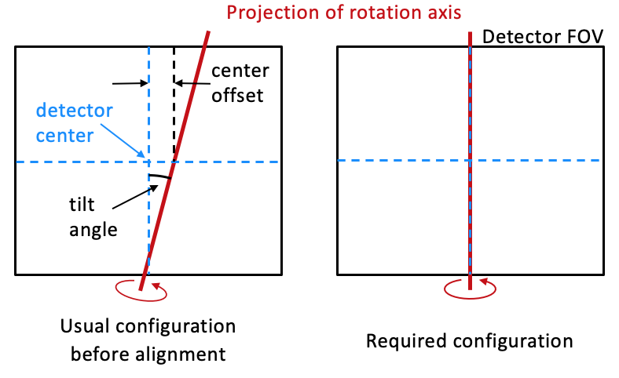
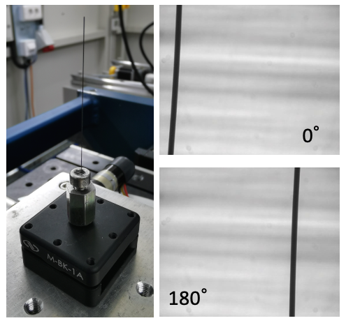
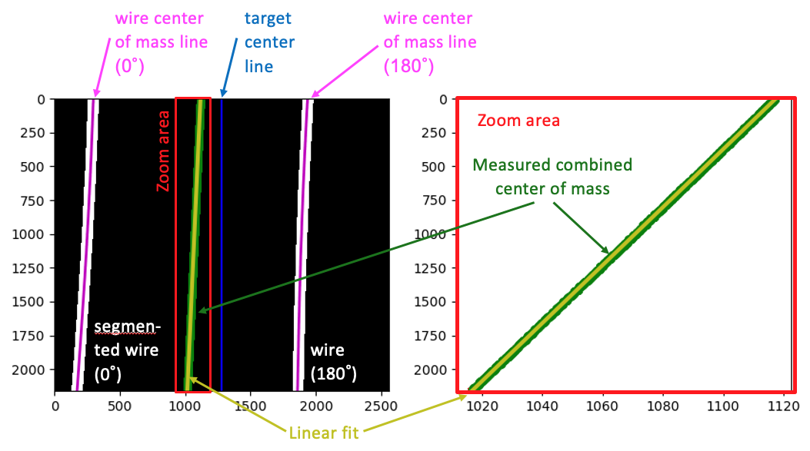
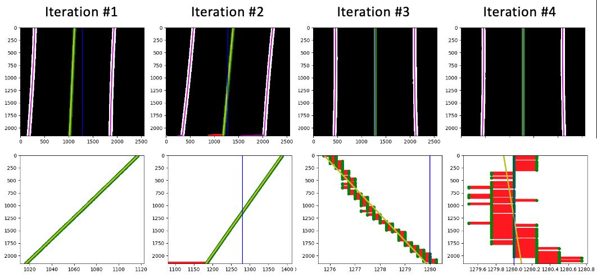

Alignment: Camera tilt and rotation axis centering
==================================================

On the importance of a good alignment
-------------------------------------

The relative alignment between the sample rotation axis and the X-ray detection
system is of crucial importance for the reconstruction of tomographic image
data.

The centering problem is illustrated schematically in
:numref:`fig_axis_alignment`. In the following paragraphs, the principles
behind the automatic alignment procedure will be discussed.

.. _`fig_axis_alignment`:


   \- Schematic showing the usual unaligned situation at the left, and the
   perfectly aligned configuration at the right.

Preparing the alignment sample
------------------------------

The alignment sample consists of a simple long and thin vertical piece of wire
made from some heavily absorbing material (tungsten) to produce a well visible attenuation
contrast over a wide energy range. One such sample is shown in
:numref:`fig_alignment_wire` (left).

.. _`fig_alignment_wire`:


   \- The alignment sample used for the camera tilt and centering alignment
   (left) and the X-ray absorption images produced by the sample at a rotation
   angle of zero and 180 degrees (right, top and bottom).

When placing the sample, two conditions must be fulfilled in order to enable an
automatic measurement of the alignment:

#. The wire must be ideally visible over the entire height of the detector. No
   other parts of the sample holder (e.g.: it's base, etc.) must be visible in
   the field of view.

#. The entirety of the wire diameter must be within the field of view at all
   visible heights for both a projection image at zero degrees and one at 180
   degrees.

Two representative projection images meeting these conditions are shown in
:numref:`fig_alignment_wire` (right).

Measuring the alignment
-----------------------

To measure the alignment, the corresponding functions of the
:mod:`~tomoalign.alignment` module are used.

To determine the alignment of a given configuration of the setup, a flat-field
image without the alignment sample is acquired first, followed by the two
projection images of the wire sample at a sample rotation angle of zero and 180
degrees. The data processing then follows these steps, the results of which are
illustrated in :numref:`fig_alignment_calculation`.

.. _`fig_alignment_calculation`:


   \- The calculation of the projected rotation axis on the detector from the
   two measured projection images at zero and 180 degrees.

Automatic alignment procedure
-----------------------------

During the automatic alignement procedure (:ref:`scripts/auto_align:Script
``auto_align.py``` or :meth:`~tomoalign.alignment.run_auto_align`), the above
alignment measurement is performed multiple times, and the alignment is
automatically adjusted by moving the camera rotation motor (tilt) and
transverse sample translation motion (centering offset) each time to approach
the ideal alignment in an iterative manner. Typically, a few iterations are
required to achieve satisfactory results. The residual misalignment is normally
well below a pixel in the centering position, and well below a pixel over the
full detector field of view in terms of the tilt, as shown in
:numref:`fig_alignment_iteration`.

.. _`fig_alignment_iteration`:


   \- The iterative improvement of the camera tilt and centering alignment.
   Note how the algorithm initially corrected the tilt in the wrong direction,
   but then detected the error in the sign and compensated for it in the next
   step. Also, the line fit in the second iteration is rejecting a set of
   anomalous data points near the bottom edge of the detector (red data points)
   which are marked as outliers by the RANSAC algorithm.


