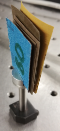
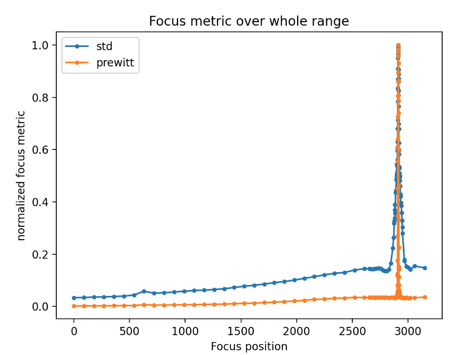
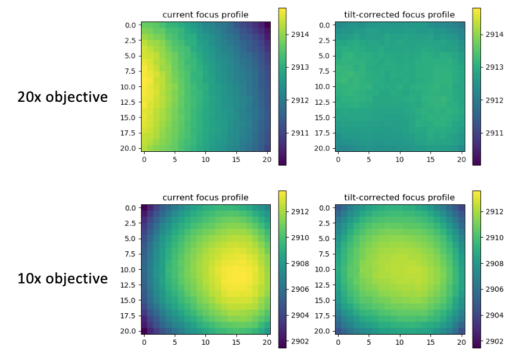

Focusing the camera
===================

One central feature of the TomoAlign package are its routines that enable
automatic focusing of the X-ray camera. This can either be carried out as a
completely automatic search for the focus position of the camera, starting from
an entirely unfocused situation, or as a local search to optimize the focus
starting from an already roughly pre-focused position.

Focus metrics
-------------

In order to automatically determine the best focus of the imaging system, a
robust and meaningful metric is required to quantify the quality of the focus
for a particular focus condition and to compare it directly to the focus
achieved with a different set of conditions. A review of all possible focus
metrics is much beyond the scope of the TomoAlign package, but the choice of
the particular metrics used was based on published information [cite!].

For the purpose of this package, the following qualities of a focus metric are
important:

* The metric should be straighforward and not too expensive to calculate for a
  given camera frame.
* The metric should peak at those imaging conditions which produce the best
  focused image.
* The metric should be robust against variations in the X-ray beam illumination
  and work for a broad set of imaging conditions and possibly test samples
  (X-ray energy, amount of phase contrast, detector magnification, etc.)
* The metric should more or less monotonically increase up to the best focus
  position and then decrease again, i.e. not show any local maxima.
* The monotonic increase should be detectable even at imaging conditions far
  away from the ideal focus conditions to detect a peak in the metric even at
  large step sizes.
* The metric should be reasonably sharply peaked around the focus position to
  get an accurate estimate of the true maximum position.

According to the literature, either metrics involving the magnitude of the
local standard deviation or those with edge-detecting or edge-enhancing
features tend to perform best over a broad range of input images.

Fairly extensive tests with the TOMCAT equipment have shown that one type if
metric was not able to reliably fulfill all of the above criteria. The most
robust solution in the end was to use a combination of two metrics to cover the
needs of all search operations:

* For **broad-range searches**, using the **local standard deviation** of the
  recorded image after filtering it with a high-pass filter seems to deliver
  the most robust results with a reliable peak detection even when using very
  large search steps. This method is automatically selected for those focus
  searches where the step size exceeds ten times the detector's pixel size
  (unless another metric is specifically selected during the call to the
  corresponding functions).
* For **short-range searches** close to the actual best focus position,
  edge-enhancing image filters perform better since the resulting focus metric
  is generally more narrowly peaked. TomoAlign by default employs the **Prewitt
  edge filter**, although similar methods such as a Sobel filter would probably
  perform equally well. The Prewitt filter is automatically selected as the
  active metric for step sizes of ten times the detector pixel size or less.

Hardware setup for automatic focusing
-------------------------------------

Focus sample
~~~~~~~~~~~~
The sample used for focusing should:

* Produce a sharp image contrast with dominant features that are typically a
  few pixels to a few dozen pixels in size.
* Produce an image contrast that is ideally perfectly homogeneous over the
  entire field of view of the detector.
* Work for a broad range of imaging conditions (X-ray energy, optical
  magnification, scintillator thicknesses, degree of edge-enhancement, etc.)

Based on the above considerations, a sample made from several stacked layers of
sand paper of different grades (80 - 1200) appears to work very reliably over a
large range of applications (see :numref:`fig_focus_sample`).

.. _`fig_focus_sample`:


   \- The standard sample for focus adjustments consists of a stack of
   sandpaper sheets with different grades (80 - 1200).


Beamline settings
~~~~~~~~~~~~~~~~~
It is important that the beamline is set up roughly correctly for the automatic
focusing to work properly. Things that need to be taken care of are:

* The front end slits and all other slits along the beam path need to be opened
  sufficiently such as to be able to homogeneously illuminate the entire
  detector's field of view.
* The camera needs to be roughly aligned with the X-ray beam such that the
  X-ray beam will illuminate the entire field of view.
* The detector's exposure time needs to be set such that even for the best
  focus, the image is not saturated anywhere (careful with edge-enhancing
  samples, which may locally achieve a higher intensity than the flat-field
  illumination without a sample!)

Automatic focusing strategy
---------------------------

Focus search vs. auto-focus
~~~~~~~~~~~~~~~~~~~~~~~~~~~

The strategy chosen for automatic focusing is outlined below. There are two
distinct regimes that need to be considered, and the following terminology is
used:

focus search:
   A focus search describes the situation where the position of the best focus
   is not known at all, and where a full search for the best focus has to be
   carried out. To protect the scintillator from crashes with the microscopy
   lenses in situations of an actual over-focus, the search is always
   initiated from a configuration where the lens is furthest away from the
   scintillator and approaching it in a controlled manner. As soon as a peak
   in the focus metric is detected, the search will be stopped and possibly a
   finer search step around the identified peak is initiated. Typically, a few
   iterations of the procedure with finer and finer search steps will be
   needed until the best focus is found.  The script and method to use in a
   focus search are :ref:`scripts/find_focus:Script ``find_focus.py``` and
   :meth:`~tomoalign.focus.run_find_focus`, respectively.

auto-focus:
   The term auto-focus is used for a situation where the optical system is
   already close to the true focus position. A relatively narrow range search
   for the actual focus position is then launched around the current position.
   Only one single scan is performed, and no iterations with varying step sizes
   are used. The script and method to use for auto-focusing are
   :ref:`scripts/auto_focus:Script ``auto_focus.py``` and
   :meth:`~tomoalign.focus.run_auto_focus`, respectively.

Focus algorithm
~~~~~~~~~~~~~~~
Irrespective of the chosen regime (focus search or auto-focus), the algorithm
generally proceeds as follows.

#. The focus motor of the microscope is moved to the start position for the
   focus scan.
#. An image is acquired with the detector
#. The image is subdivided into n x m sub-images (21 x 21 by default).
#. The focus metric is is calculated for each one of the sub-images and stored
   in an array.
#. The stop criterium for the scan is checked and the scan is terminated when
   the criterium is met.
#. If not terminated, the scan will move the focus motor to the next position
   and start over with the processing.
#. Upon termination of the scan, the focus motor is moved to the position with
   with the highest value of the focus metric.

Stopping criterium
~~~~~~~~~~~~~~~~~~
The stopping criterium used for a given scan is the following: If the average
of the focus metric in the central sub-image over the last N (configurable)
scan steps (this is called the *overshoot* parameter) falls below a certain
fraction (configurable, default = 70%) of the detected maximum value, the scan
is stopped. For coarse step sizes, the overshoot parameter is typically chosen
to be quite small (default = 3 for the largest automatic search steps) to avoid
collisions with the scintillator. For finer scan steps, this overshoot
parameter is increased to ensure a meaningful number of data points is recorded
past the peak (default = 25 for the smallest scan steps).
Note that only the central sub-image is being considered in the calculation of
the stopping criterium.

During the focus scan, the two selected focus metrics (standard deviation and
the Prewitt edge filtered intensity evaluated locally in the central sub-image)
are plotted and updated for each scan point. :numref:`fig_focus_runs` shows
four increasingly narrow search iterations during a focus search.

.. _`fig_focus_runs`:
.. figure:: images/focus_runs.png
   :width: 100 %
   :figwidth: 100 %

   \- Plot of the two chosen focus metrics (std: local standard deviation;
   prewitt: average of Prewitt edge filtered image), normalized to their
   maximum value encountered during the scan, for four consecutive focus
   search runs with increasingly narrow search ranges. (Note that both metrics
   are independently normalized for each of the plots, so the absolute values
   between plots cannot be compared.)

Plotting all of these data points in the same graph, as shown in
:numref:`fig_focus_runs_combined`, it becomes immediately obvious that the
standard deviation not only has a much broader peak, but also exhibits a slowly
rising baseline around the actual peak which makes it very suitable for the
long-range search, while the Prewitt edge filter shows a clean, narrow peak
with a very low baseline around the true focus position, perfect for
fine-tuning the focus position and analyzing the focus profile (see next
paragraph). Note that in the upper left graph of :numref:`fig_focus_runs`, the search step was so large compared to the peak width of the Prewitt metric that the peak itself is missing entirely in the plot, while the normalization has emhphasized the small variations in the pedestal.

.. _`fig_focus_runs_combined`:


   \- Plot of the two normalized focus metrics over the combined search range
   of the four scans shown above.


Focus analysis
--------------

Once the focus search or auto-focus procedure have finished, the recorded data
of the (last) focus scan is analyzed in more detail to provide feedback on the
quality of the focus across the entire field of view.

As mentioned above, the results of the focus metric evaluation have been saved during the last scan in an array for all of the defined sub-regions of the image. For each of these sub-regions, the measured focus profile is now fitted with a Gaussian plus a constant term to determine the peak position. The corresponding data points and curve fits are then plotted for the central sub-image and the four corners, as can be seen in :numref:`fig_focus_lineprofiles`.


.. _`fig_focus_lineprofiles`:
.. figure:: images/focus_lineprofiles.png
   :align: center
   :width: 90 %
   :figwidth: 100 %

   \- Measured focus profiles (data points) and fitted Gaussians (lines) in the
   center sub-image patch and the four corner patches (NW, NE, SW, SE) of the
   field of view for both focus metrics. The best focus is clearly not achieved
   at the same focus motor position for these different patches of the image.

It is immediately evident from the figure that the best focus is not achieved for the same focus motor position in the different parts of the image. To visualize this variation in the best focus position over the full field of view, the fitted value for the best focus for each of the sub-images is plotted as an image, shown in :numref:`fig_focus_2dprofiles` for both focus metrics.

.. _`fig_focus_2dprofiles`:
.. figure:: images/focus_2dprofiles.png
   :align: center
   :width: 100 %
   :figwidth: 100 %

   \- Variations in the best focus position across the detector's field of view for both focus metrics'.

This 2-dimensional representation illustrates even more convincingly that the best focus value varies significantly across the field of view. It is evident that there is a pronounced slope of the best focus position from left to right, and both focus metrics agree. This slope is caused by a tilt of the scintillator with respect to the optical axis of the imaging system and should be corrected. The necessary correction can be calculated straightforwardly from the data (see below).

At this point, the overall best focus position for the entire field of view is calculated as the geometric mean of all focus position values. If this value is deemed reliable, i.e., if it does not deviate more than a certain reasonable amount from the best focus position identified for the central sub-image during the search procedure described above, the focus motor is now moved to this position.

The result of the focus scan and analysis is also reported in the command line shell as follows:

.. code-block:: none

   Autofocus results:
   ==================
   Best central focus at: 2913.01
   Best overall focus at: 2912.85
   Maximum focus difference in FOV: 4.79
   Maximum planar focus tilt through FOV: 3.88
   Maximum focus difference after tilt correction in FOV: 1.30
   Correct focus tilt:
     Turn screw #1 by -0.67 rotations = -242 degrees
     Turn screw #2 by +0.67 rotations = +242 degrees
     Turn screw #3 by -0.16 rotations = -59 degrees
     Positive rotation direction is clockwise
     (For screw numbering see figure 7)


Correcting the scintillator tilt
--------------------------------

Based on the focus analysis, the residual tilt of the scintillator is calculated by fitting a plane through the 2-dimensional focus profile of the active focus metric (usually the Prewitt filter). Subtracting this tilt plane from the measured focus profile, shown on the left of :numref:`fig_focus_2Dprofile_untilt`, gives an estimate of what the focus profile would look like after the tilt correction, as shown on the right in that figure.

.. _`fig_focus_2dprofile_untilt`:
.. figure:: images/focus_2dprofile_untilt.png
   :align: center
   :width: 100 %
   :figwidth: 100 %

   \- Effect of removing a planar slope from the measured focus profile. The measured profile (left) becomes much more homogeneous (right) after subtracting a 2-dimensional tilt plane from the data (which represents the scintillator tilt).

It is obvious that the adjusted scintillator orientation will result in a much more homogeneous focusing across the detector's field of view. If the used optics provides a means to adjust the scintillator tilts by means of a kinematic mount or a similar system, and if its geometry (screw positions, directions, and pitches) with respect to the detector's center point are known, the tilt plane can be extrapolated to these positions to calculate the necessary corrections to flatten the scintillator. This is shown for the kinematic mount of the standard TOMCAT microscope (Optique Peter) in :numref:`fig_focus_scintillator_adjust` (right) together with a graphical representation of the applicable adjustments (left). The expected reduction in the spread of focus positions is also reported in the output on the command line (see above).

Simply follow the instructions on how to apply the necessary adjustments to the scintillator mount. Take care to turn the screws in the correct direction, as indicated in the figure. Corrections of less than about 90 degrees are usually negligible in terms of their image quality improvement, so getting the adjustments accurate to approximately a few tens of degrees is generally sufficient and easily achievable manually.

.. _`fig_focus_scintillator_adjust`:
.. figure:: images/focus_scintillator_adjust.png
   :align: center
   :width: 100 %
   :figwidth: 100 %

   \- Calculated scintillator tilt adjustments (left) as they should be applied to the mechanical scintillator mount (right).

Once you have applied the indicated corrections, it is necessary to repeat the auto-focusing scan as the exact focus position will probably have shifted slightly but sufficiently to deteriorate the focus quality.

Note that not all microscopes provide an easily accessible or actually any means for mechanical scintillator adjustments. In these cases, the quantified focus variations can simply serve as an indicator for the impact this may have on the measurements.

In general, the variation in focus position is only significant if it is comparable or larger than the intrinsic depth of focus (DOF) of the optical system, i.e., only when it actually affects the focus quality noticeably. Currently, however, the employed focus metrics do not allow for a direct calculation of the actual depth of focus (although the peak width of the focus profiles should be proportional to the DOF, the proportionality constant is not know a priori). Therefore the user has to judge whether any variation in the focus position is relevant for his setup. Nonetheless, the information provided by these scans can help to make an informed judgement.


Residual focus errors
---------------------

Note that not all of the variations in the optimal focus position across the field of view are caused by a scintillator tilt, which can only correct for planar contributions to the variations. Higher order contributions are indicative of imperfections in the optical imaging system, such as lens abberations and barrel distortion effects. These seem to be more pronounced for the lower magnification lenses at TOMCAT, as can be seen by comparing the 20x objective with the 10x objective in :numref:`fig_focus_2dprofile_objectives`, where the latter produces a distinct focus "bump" in the center of the image. Note that also for this situation, moving the focus motor to the geometric mean of all analyzed focus positions produces the best possible obtainable overall focus throughout the image.

.. _`fig_focus_2dprofile_objectives`:


   \- Variations in focus quality across the field of view for different objectives. For the 20x magnification, correcting the scintillator tilt results in a nice planar focus profile, while the 10x objective exhibits a pronounced residual focus profile with a bump-like shape which cannot be corrected mechanically.
