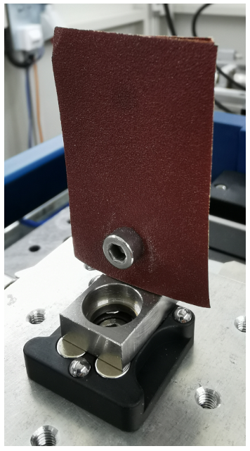
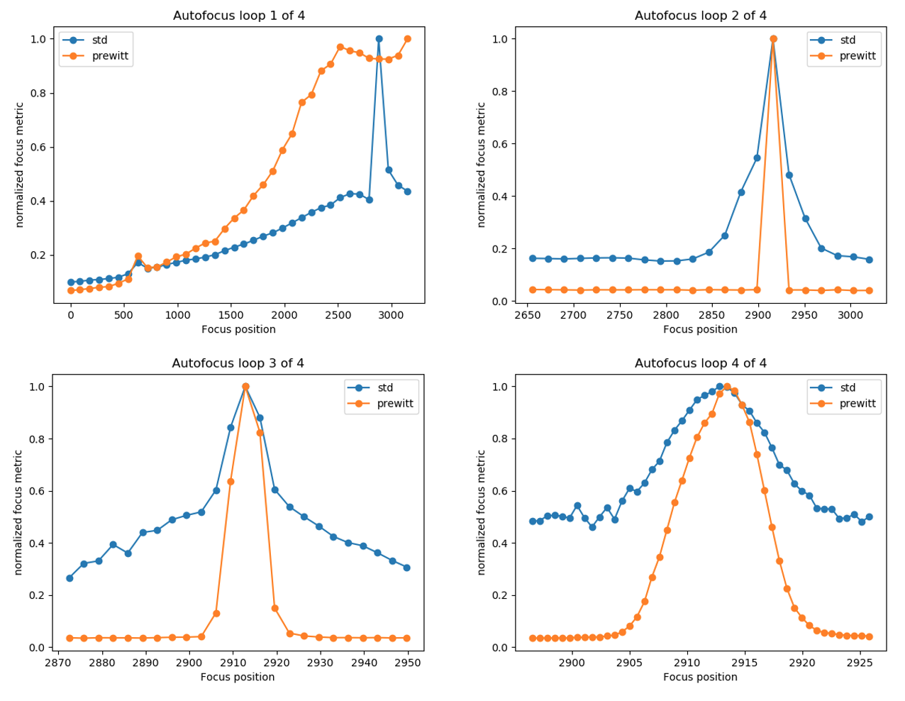
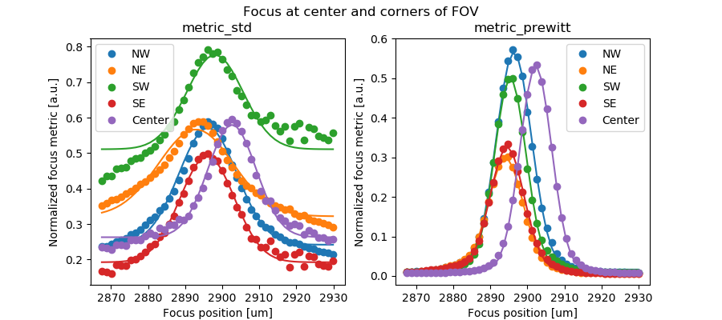
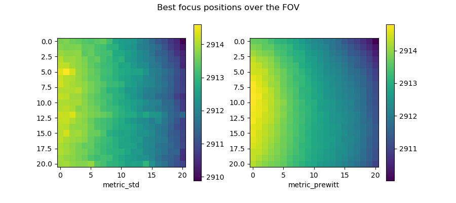
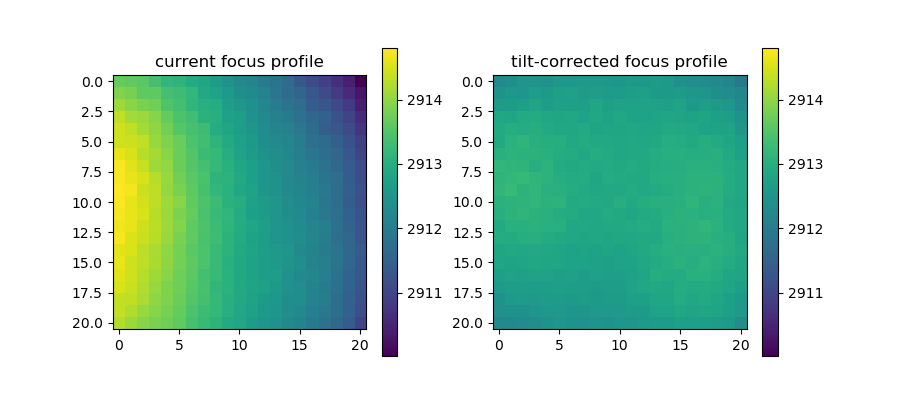
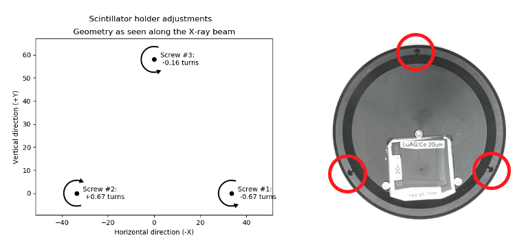

Focusing the camera
===================

One central feature of the TomoAlign package are its routines that enable
automatic focusing of the X-ray camera. This can either be carried out as a
completely automatic search for the focus position of the camera, starting from
an entirely unfocused situation, or as a local search to optimize the focus
starting from an already roughly pre-focused position.

Hardware setup for automatic focusing
-------------------------------------

Focus sample
~~~~~~~~~~~~
The sample used for focusing should:

* Produce a sharp image contrast with dominant features that are typically a
  few pixels to a few dozen pixels in size.
* Produce an image contrast that is ideally perfectly homogeneous over the
  entire field of view of the detector.
* Work for a broad range of imaging conditions (X-ray energy, optical
  magnification, scintillator thicknesses, degree of edge-enhancement, etc.)

Based on the above considerations, a sample made from several stacked layers of
sand paper of different grades (80 - 1200) appears to work very reliably over a
large range of applications (see :numref:`fig_focus_sample`).

.. _`fig_focus_sample`:

   \- The standard sample for focus adjustments consists of a stack of
   sandpaper sheets with different grades (80 - 1200).

Beamline settings
~~~~~~~~~~~~~~~~~
It is important that the beamline is set up roughly correctly for the automatic
focusing to work properly. Things that need to be taken care of are:

* The front end slits and all other slits along the beam path need to be opened
  sufficiently such as to be able to homogeneously illuminate the entire
  detector's field of view.
* The camera needs to be roughly aligned with the X-ray beam such that the
  X-ray beam will illuminate the entire field of view.
* The detector's exposure time needs to be set such that even for the best
  focus, the image is not saturated anywhere (careful with edge-enhancing
  samples, which may locally achieve a higher intensity than the flat-field
  illumination without a sample!)

Focus algorithm
---------------

During the focus scan, the two selected focus metrics (standard deviation and
the Prewitt edge filtered intensity evaluated locally in the central sub-image)
are plotted and updated for each scan point. :numref:`fig_focus_runs` shows
four increasingly narrow search iterations during a focus search.

.. _`fig_focus_runs`:

   \- Plot of the two chosen focus metrics (std: local standard deviation;
   prewitt: average of Prewitt edge filtered image), normalized to their
   maximum value encountered during the scan, for four consecutive focus
   search runs with increasingly narrow search ranges. (Note that both metrics
   are independently normalized for each of the plots, so the absolute values
   between plots cannot be compared.)

Focus analysis
--------------

Once the focus search or auto-focus procedure have finished, the recorded data
of the (last) focus scan is analyzed in more detail to provide feedback on the
quality of the focus across the entire field of view, as can be seen in :numref:`fig_focus_lineprofiles`.

.. _`fig_focus_lineprofiles`:

   \- Measured focus profiles (data points) and fitted Gaussians (lines) in the
   center sub-image patch and the four corner patches (NW, NE, SW, SE) of the
   field of view for both focus metrics. The best focus is clearly not achieved
   at the same focus motor position for these different patches of the image.

To visualize the variation in the best focus position over the full field of view, the fitted value for the best focus for each of the sub-images is plotted as an image, shown in :numref:`fig_focus_2dprofiles` for both focus metrics.

.. _`fig_focus_2dprofiles`:

   \- Variations in the best focus position across the detector's field of view for both focus metrics'.

The pronounced slope of the best focus position from left to right is caused by a tilt of the scintillator with respect to the optical axis of the imaging system and should be corrected. The necessary correction can be calculated straightforwardly from the data (see below).

The result of the focus scan and analysis is also reported in the command line shell as follows:

.. code-block:: none

   Autofocus results:
   ==================
   Best central focus at: 2913.01
   Best overall focus at: 2912.85
   Maximum focus difference in FOV: 4.79
   Maximum planar focus tilt through FOV: 3.88
   Maximum focus difference after tilt correction in FOV: 1.30
   Correct focus tilt:
     Turn screw #1 by -0.67 rotations = -242 degrees
     Turn screw #2 by +0.67 rotations = +242 degrees
     Turn screw #3 by -0.16 rotations = -59 degrees
     Positive rotation direction is clockwise
     (For screw numbering see figure 7)

Correcting the scintillator tilt
--------------------------------

Based on the focus analysis, the residual tilt of the scintillator is calculated by fitting a plane through the 2-dimensional focus profile of the active focus metric (usually the Prewitt filter). Subtracting this tilt plane from the measured focus profile, shown on the left of :numref:`fig_focus_2Dprofile_untilt`, gives an estimate of what the focus profile would look like after the tilt correction, as shown on the right in that figure.

.. _`fig_focus_2dprofile_untilt`:

   \- Effect of removing a planar slope from the measured focus profile. The measured profile (left) becomes much more homogeneous (right) after subtracting a 2-dimensional tilt plane from the data (which represents the scintillator tilt).

It is obvious that the adjusted scintillator orientation will result in a much more homogeneous focusing across the detector's field of view. If the used optics provides a means to adjust the scintillator tilts by means of a kinematic mount or a similar system, and if its geometry (screw positions, directions, and pitches) with respect to the detector's center point are known, the tilt plane can be extrapolated to these positions to calculate the necessary corrections to flatten the scintillator. This is shown for the kinematic mount of the standard TOMCAT microscope (Optique Peter) in :numref:`fig_focus_scintillator_adjust` (right) together with a graphical representation of the applicable adjustments (left). The expected reduction in the spread of focus positions is also reported in the output on the command line (see above).

Simply follow the instructions on how to apply the necessary adjustments to the scintillator mount. Take care to turn the screws in the correct direction, as indicated in the figure. Corrections of less than about 90 degrees are usually negligible in terms of their image quality improvement, so getting the adjustments accurate to approximately a few tens of degrees is generally sufficient and easily achievable manually.

.. _`fig_focus_scintillator_adjust`:

   \- Calculated scintillator tilt adjustments (left) as they should be applied to the mechanical scintillator mount (right).

.. note::
    Once you have applied the indicated corrections, it is necessary to repeat the auto-focusing scan as the exact focus position will probably have shifted slightly but sufficiently to deteriorate the focus quality.

.. note::
    Note that not all microscopes provide an easily accessible or actually any means for mechanical scintillator adjustments. In these cases, the quantified focus variations can simply serve as an indicator for the impact this may have on the measurements.

In general, the variation in focus position is only significant if it is comparable or larger than the intrinsic depth of focus (DOF) of the optical system, i.e., only when it actually affects the focus quality noticeably.